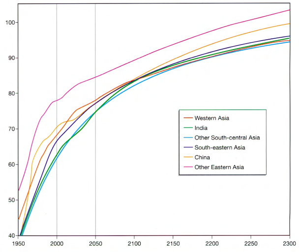

# Writing 1

## Requirement

The graph below shows the life expectancy of people living in Asian regions from 1950 and predicts life expectancy until 2300.

## Writing (191 words)

A glance at the line graph provided illustrates the life span of inhabitants in Asian regions from 1950 and foreshadows life span until 2300.
It can be seen clearly that longevity in all regions rise sharply and continuously throughout the period. It is also interesting to note that other Eastern Asia remains to be the highest life expectancy region from 1950 to 2300.

According to the graph, Eastern Asians' longevity shot up from somewhere in the vicinity of 53 years to just under 80 years by 2000. This figure is anticipated to continue its growing trajectory in the following three decades though slowed down after 2050. Meanwhile other regions' life expectancy do not have distinctive features, their residents were expected to live up to 70 years old in 2000 and the figure is projected to be more than 90 in 2023.

In conclusion, the bar chart reveals a remarkable and substantial rise in life span across Asia from 1950 to 2300. Eastern Asia consistently maintains the first position and anticipates life expectancy of 100 years. The remaining areas show less distinct differences and are projected to reach more than 90 years.
