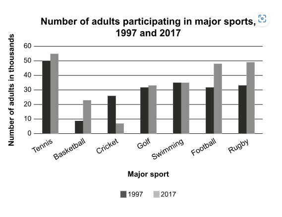

# Writing 1

## Requirement

The chart below shows the number of adults participating in different major sports in one area, in 1997 and 2017.

Summarize the information by selecting and reporting the main features, and make comparisons where relevant.

## Writing (155 words)

A glance at the bar chart provided illustrates the number of adults engaging in prominent sports in the years of 1997 and 2017.
It can be seen clearly that others than crickets, total amount of major sports enjoyers is greater in 2017 than 1997. It is also interesting to note that tennis always saw more players than others in both years.

According to the chart, the number of adults prefer to play football and rugby skyrocketed by almost 20000 while the count of basketball players doubled from about 9000 in 1997 to more than 20000 in 2017. Tennis, golf, swimming all experienced an insignificant increment in active participants. The only declining sport is cricket, which sharply fell three-fold to just about 8000.

In conclusion, the bar chart reveals an overall grow in adult participants in prominent sports in 1997 and 2017, notably in football and rugby, with cricket being the only exception experiencing a drop.
